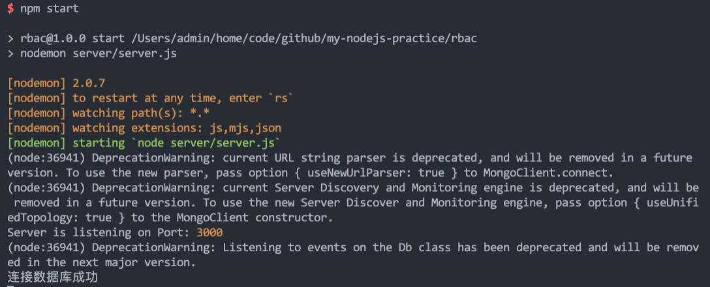
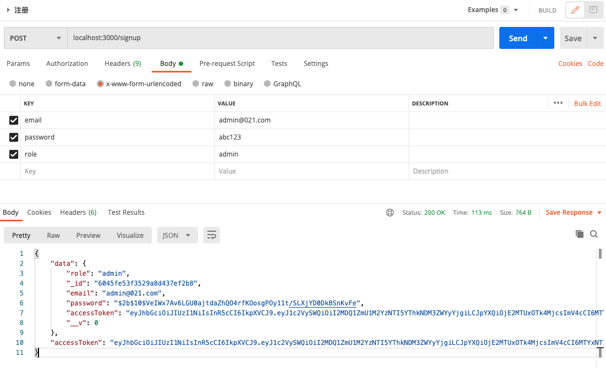
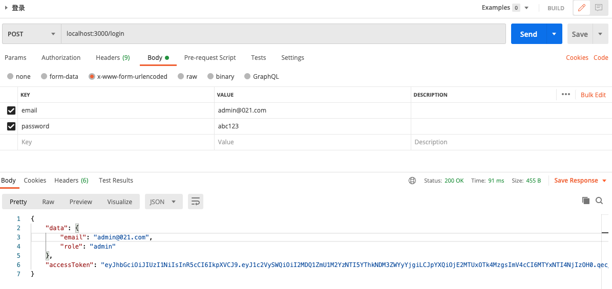
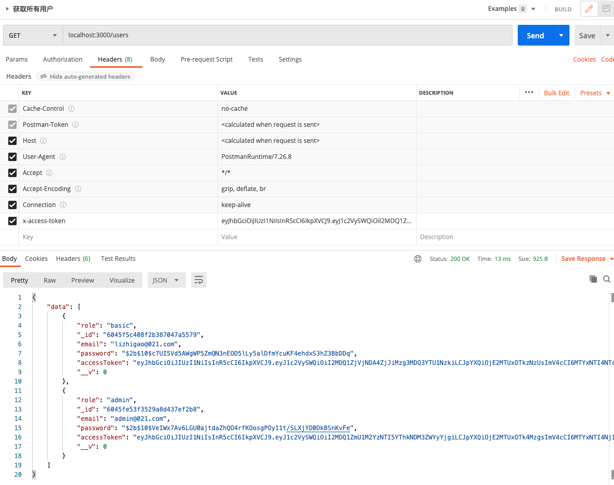

# 权限控制实践

- [express](https://github.com/expressjs/express): 开发框架
- [bcrypt](https://github.com/kelektiv/node.bcrypt.js): 密码加密存储
- [body-parser](https://github.com/expressjs/body-parser): 解析请求头数据
- [jsonwebtoken](https://github.com/auth0/node-jsonwebtoken): token 鉴权
- [mongoose](https://github.com/Automattic/mongoose): MongoDB 的 ODM(Object Document Mapping) 库
- [accesscontrol](https://github.com/onury/accesscontrol): 提供基于角色和属性的权限控制

## 运行

```bash
# 运行MongoDB
mongod --dbpath /usr/local/mongodb/data --logpath /usr/local/mongodb/log/mongod.log --fork

# 启动服务
npm start
```



## postman 测试

- 注册：localhost:3000/signup
  

- 登录：localhost:3000/login
  

- 获取所有用户：localhost:3000/users
  

## 参考

> [https://soshace.com/implementing-role-based-access-control-in-a-node-js-application/](https://soshace.com/implementing-role-based-access-control-in-a-node-js-application/)
